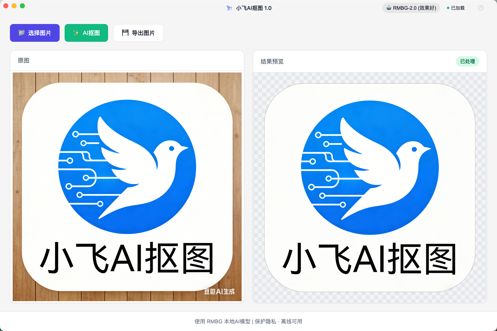
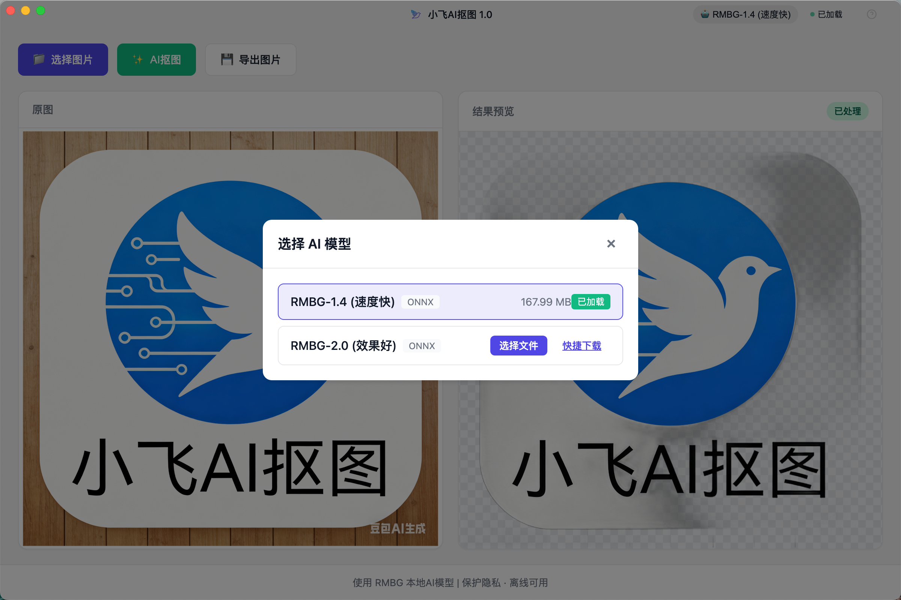
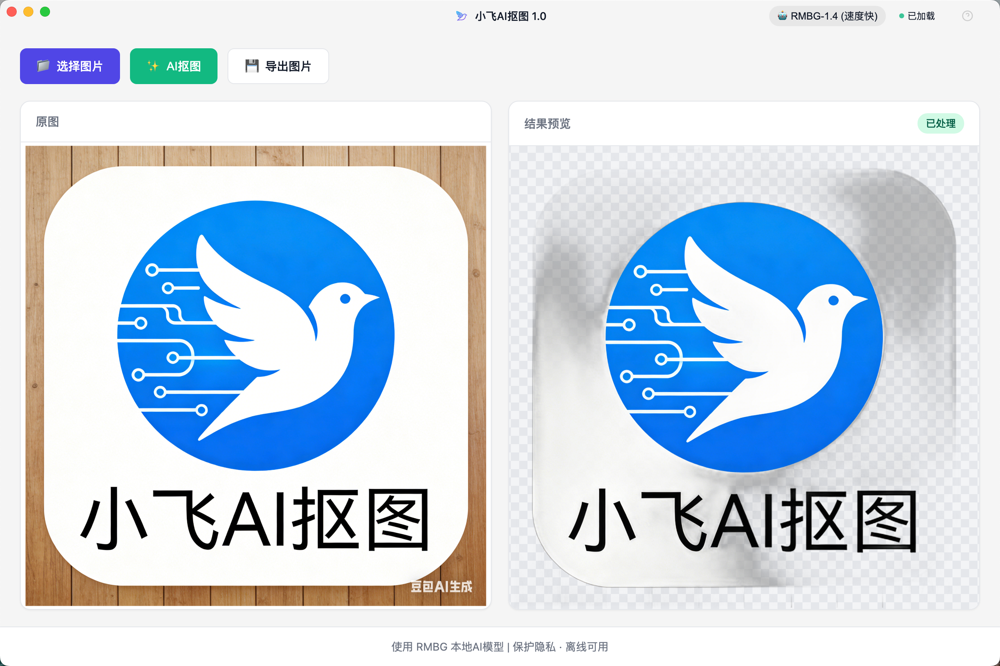

# 小飞AI抠图

一款完全本地运行的AI智能抠图桌面应用，保护您的隐私，无需联网即可快速去除图片背景。


## 下载

| 平台 | 下载地址 |
|------|----------|
| macOS Apple Silicon (M1/M2/M3) | [小飞AI抠图-1.0.0-arm64.dmg](https://github.com/pumf/ai-cutout/releases/download/v1.0.0/AI.-1.0.0-arm64.dmg) |
| macOS Intel | [小飞AI抠图-1.0.0-Intel.dmg](https://github.com/pumf/ai-cutout/releases/download/v1.0.0/AI.-1.0.0-Intel.dmg) |
| Windows | [小飞AI抠图 Setup 1.0.0.exe](https://github.com/pumf/ai-cutout/releases/download/v1.0.0/AI.Setup.1.0.0.exe) |

## 软件介绍

小飞AI抠图是一款基于AI技术的本地化图片背景去除工具。通过内置的RMBG-1.4 AI模型，可以在本地完成图像分割和背景移除，无需上传图片到服务器，真正保护用户隐私。

### 核心特点

- 🖼️ **智能抠图** - AI自动识别并去除图片背景
- 🔒 **本地运行** - 完全离线处理，保护隐私
- 🚀 **快速高效** - 优化推理性能，处理速度快
- 💻 **跨平台** - 支持 macOS、Windows、Linux
- 🎨 **多种格式** - 支持 PNG，JPG、WebP 等常见图片格式
- 🤖 **多模型选择** - 可选择切换 RMBG-1.4（快速）或 RMBG-2.0（精细）模型

## 效果展示

| 效果 | 说明 |
|------|------|
|  | RMBG-2.0 模型效果，原图与抠图对比 |
|  | 支持切换不同AI模型 |
|  | RMBG-1.4 内置模型效果，开箱即用 |

## 技术方案

### 技术栈

| 层级 | 技术选型 |
|------|----------|
| 桌面框架 | Electron |
| 前端 | React + TypeScript + Vite |
| 后端 | Python FastAPI |
| AI引擎 | ONNX Runtime |
| 抠图模型 | RMBG-1.4 (ONNX) |

### 项目结构

```
ai-cutout/
├── src/
│   ├── main/           # Electron 主进程
│   └── renderer/       # React 前端
├── backend/            # Python 后端
├── model_files/        # AI 模型文件
│   └── 1.4/           # RMBG-1.4 模型
├── venv/              # Python 虚拟环境
├── release/           # 打包输出
└── package.json       # 项目配置
```

### 体积优化

- 应用体积：~660MB（App）/ ~341MB（DMG压缩后）
- AI模型：~176MB（已压缩）
- Python运行时：~245MB

## 功能介绍

### 1. 选择图片

- 点击"选择图片"按钮选择本地图片
- 支持拖拽图片到窗口
- 支持格式：PNG、JPG、WebP

### 2. AI抠图

- 内置 RMBG-1.4 AI模型，开箱即用
- 支持切换到 RMBG-2.0 模型（效果更好，需下载）
- 自动加载内置模型，无需手动配置

### 3. 保存结果

- 处理完成后可保存为PNG格式
- 保留透明背景

### 4. 模型管理

- 内置 RMBG-1.4 模型（速度快）
- 支持加载自定义 ONNX 模型
- 模型状态实时显示

### 5. 图片操作

- 鼠标滚轮缩放图片
- 拖拽移动图片位置

## 使用说明

### 安装

#### macOS

1. 下载 `小飞AI抠图-1.0.0-arm64.dmg` 或 `小飞AI抠图-1.0.0-x64.dmg`
2. 打开 DMG 文件
3. 将应用拖拽到应用程序文件夹
4. 双击运行

#### Windows

1. 下载 `小飞AI抠图-1.0.0-setup.exe`
2. 运行安装程序
3. 按照提示完成安装

#### Linux

1. 下载 `小飞AI抠图-1.0.0.AppImage`
2. 添加执行权限：`chmod +x 小飞AI抠图-1.0.0.AppImage`
3. 运行：`./小飞AI抠图-1.0.0.AppImage`

### 快速开始

1. **启动应用** - 双击图标打开软件
2. **选择图片** - 点击"选择图片"或拖拽图片到窗口
3. **AI抠图** - 点击"AI抠图"按钮开始处理
4. **保存结果** - 处理完成后点击"保存图片"

### 常见问题

**Q: 首次运行需要联网吗？**
A: 不需要，软件完全本地运行。首次启动时会自动加载内置的AI模型。

**Q: 支持批量处理吗？**
A: 目前版本支持单张图片处理。

**Q: 为什么处理速度较慢？**
A: 处理速度取决于电脑配置。推荐使用支持AI加速的CPU或GPU。

**Q: 如何切换AI模型？**
A: 点击右上角的模型名称，在弹出的模型选择界面中可以切换或加载自定义模型。

## 性能对比

| 模型 | 速度 | 效果 | 适用场景 |
|------|------|------|----------|
| RMBG-1.4 | 快 | 一般 | 日常使用 |
| RMBG-2.0 | 慢 | 更好 | 对质量要求高 |

## 注意事项

- 软件需要本地有Python环境（打包版本已内置）
- 处理大图片时可能需要较长时间
- 建议至少有4GB可用内存

## 许可证

MIT License

## 贡献

欢迎提交 Issue 和 Pull Request！

## 致谢

- [RMBG](https://github.com/AbsoluteAI/RMBG) - AI抠图模型
- [ONNX Runtime](https://onnxruntime.ai/) - 高性能AI推理引擎
- [Electron](https://www.electronjs.org/) - 跨平台桌面应用框架
